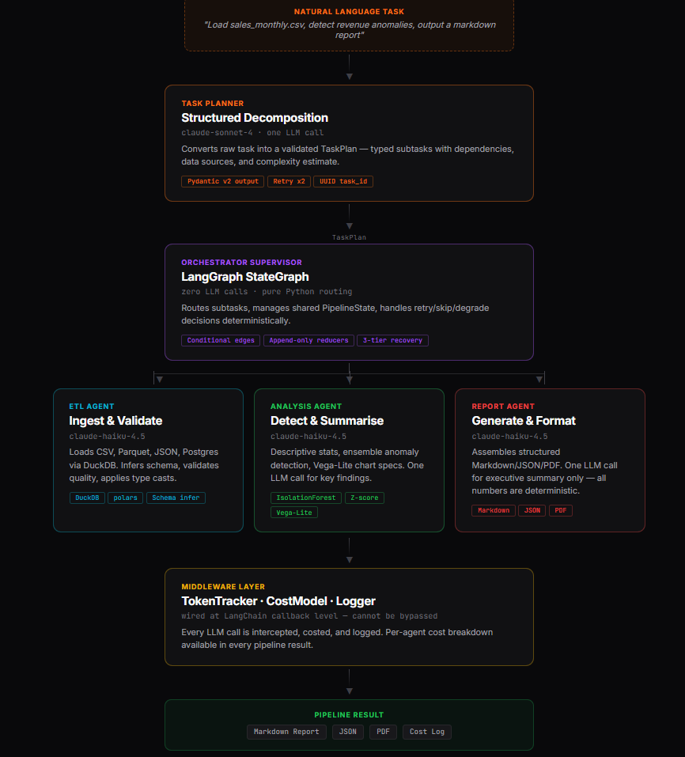
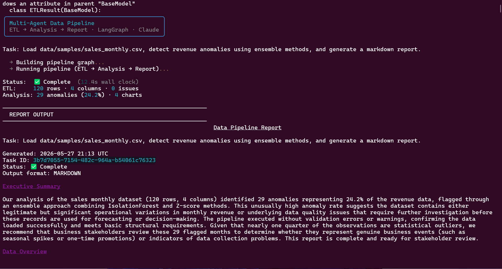

# Multi-Agent Data Pipeline

> **Production-grade automated data infrastructure** for ETL, anomaly detection, and report generation using LangGraph, Claude, DuckDB, and deterministic statistical tooling.

[](https://python.org)
[](https://langchain-ai.github.io/langgraph/)
[](https://anthropic.com)
[]()
[]()
[]()

---

## Overview

This project automates a common analyst workflow:

1. Load and validate structured data
2. Detect anomalies and statistical outliers
3. Generate charts and summaries
4. Produce a structured report
5. Return auditable outputs with full execution state

Instead of building a fragile “LLM agent” that generates numbers directly, this system combines:

* deterministic tools (`DuckDB`, `polars`, `scikit-learn`)
* typed orchestration (`LangGraph`, `Pydantic`)
* constrained LLM reasoning (`Claude Sonnet / Haiku`)
* production-style failure recovery
* measurable evaluation harnesses

The result is a pipeline that behaves more like a reliable backend service than a chatbot.

---

## What This Solves

Most data teams spend a large portion of analyst time on repetitive operational work:

* loading and cleaning recurring datasets
* validating schema quality
* checking for anomalies
* generating recurring reports
* formatting summaries for stakeholders

These workflows are valuable but largely mechanical once patterns are established.

This pipeline accepts a natural-language instruction like:

```text
"Analyze last month's sales data and flag anything unusual"
```

and autonomously executes the workflow end-to-end:

* ingest data
* validate schema quality
* run anomaly detection
* generate chart specifications
* produce markdown / JSON / PDF reports
* log execution state and cost metadata

A human reviews the output — not the intermediate process.

---


## Why This Architecture

Most “AI agent” demos fail for the same reasons:

* too much hidden state
* LLMs generating business logic
* no deterministic guarantees
* no evaluation framework
* no failure recovery
* no operational visibility

This project takes the opposite approach.

### Design principles

* **Typed state over message passing**

  * All agents share a validated `PipelineState`
  * Every transition is explicit and inspectable

* **LLMs for planning, not computation**

  * Statistical analysis is deterministic
  * Models orchestrate tools rather than invent results

* **Graceful degradation over hard failure**

  * The pipeline always returns structured output
  * Failures are annotated, not silently swallowed

* **Cost visibility as a first-class concern**

  * Every model call is tracked
  * Benchmark scripts compare routing strategies

* **Evaluations built into the repo**

  * Fixture-based testing
  * Cost benchmarking
  * End-to-end execution harnesses

---

## Demo

```bash
python scripts/run_demo.py
```

Example workflow:

```text
Task:
Analyze monthly sales data and generate a markdown report with anomaly detection.

Pipeline:
✓ ETL completed
✓ Schema validated
✓ Anomaly detection completed
✓ Vega-Lite charts generated
✓ Markdown report rendered

Execution time: 42.3s
Estimated API cost: $0.0061
Status: COMPLETE
```

---

## Example Output

### Generated Findings

```markdown
# Monthly Revenue Analysis

## Summary
Revenue increased 14.2% month-over-month.

## Detected Anomalies
- 2025-04-18: Revenue spike (+4.8σ)
- 2025-04-22: Unusual refund activity

## Recommendation
Investigate refund processing changes introduced during week 16.


```

### Generated Chart Spec

```json
{
  "mark": "line",
  "encoding": {
    "x": {"field": "date"},
    "y": {"field": "revenue"}
  }
}
```

---

## Business Impact

| Metric                  | Manual Workflow   | This Pipeline        |
| ----------------------- | ----------------- | -------------------- |
| Time from data → report | 2–4 analyst hours | 45–90 seconds        |
| Cost per report         | $80–$200          | ~$0.003–$0.04        |
| Consistency             | Varies by analyst | Deterministic schema |
| Anomaly detection       | Often ad hoc      | Automated every run  |
| Auditability            | Email threads     | Full typed state log |
| Scale                   | Human bottleneck  | Parallelizable       |

### Conservative ROI Example

A team generating 20 recurring reports/week at ~$80 analyst cost:

* Manual annual cost: **~$83,000**
* Pipeline API cost: **~$30–$100/year**

The larger gain is reclaimed analyst time for higher-leverage work.

---

# Architecture

```text
User Task (natural language)
         │
         ▼
┌─────────────────────────────────────────────────────────┐
│  Task Planner  (Claude Sonnet 4)                       │
│  Decomposes task → typed TaskPlan                      │
└────────────────────┬───────────────────────────────────┘
                     │
                     ▼
┌─────────────────────────────────────────────────────────┐
│  Orchestrator (LangGraph StateGraph Supervisor)        │
│  Deterministic routing · retries · state transitions   │
└──────┬──────────────┬──────────────┬───────────────────┘
       │              │              │
       ▼              ▼              ▼
┌──────────┐  ┌───────────────┐  ┌──────────────────┐
│ETL Agent │  │Analysis Agent │  │Report Agent      │
│DuckDB    │  │IsolationForest│  │Markdown / PDF    │
│polars    │  │Z-score        │  │JSON emitter      │
│Validation│  │Vega-Lite      │  │Executive summary │
└──────────┘  └───────────────┘  └──────────────────┘
```

---

## Key Architectural Decisions

### Typed Shared State

All agents operate on a shared `PipelineState` using LangGraph reducers.

Benefits:

* partial retries
* resumability
* deterministic transitions
* auditability
* lower orchestration complexity

### Planner ≠ Router

Task decomposition and execution routing are intentionally separated.

| Component    | Responsibility                |
| ------------ | ----------------------------- |
| Planner      | Interpret task intent         |
| Orchestrator | Execute deterministic routing |

The orchestrator itself contains no agentic reasoning.

### Deterministic Statistical Execution

The LLM never generates:

* anomaly scores
* aggregates
* statistical outputs
* chart data

All computation is executed directly through:

* DuckDB
* polars
* scipy
* scikit-learn

### Failure Recovery

Every agent supports three-tier degradation:

| Tier       | Behaviour                          |
| ---------- | ---------------------------------- |
| Retry      | Exponential backoff                |
| Simplified | Reduced dataset / lighter analysis |
| Degraded   | Minimal valid structured output    |

The pipeline prefers degraded correctness over hard failure.

---

# Tech Stack

| Layer           | Technology           | Purpose                         |
| --------------- | -------------------- | ------------------------------- |
| Orchestration   | LangGraph            | Typed workflow graphs           |
| Planning LLM    | Claude Sonnet 4      | Structured task planning        |
| Execution LLM   | Claude Haiku 4.5     | Low-cost agent execution        |
| Data processing | DuckDB + polars      | Fast structured analytics       |
| Statistics      | scipy + scikit-learn | Deterministic anomaly detection |
| Validation      | Pydantic v2          | Typed contracts                 |
| Charts          | Vega-Lite            | Portable JSON visualizations    |
| API             | FastAPI              | Async typed endpoints           |
| Logging         | structlog            | Structured execution logs       |
| Testing         | pytest               | Unit + integration testing      |

---

# Model Routing Strategy

Different phases use different model tiers:

```text
Planner      → Sonnet 4
Orchestrator → deterministic Python
ETL Agent    → Haiku 4.5
Analysis     → Haiku 4.5
Report       → Haiku 4.5
```

This reduces operational cost significantly while preserving planning quality.

| Strategy      | Avg Cost / Run |
| ------------- | -------------- |
| All Sonnet    | ~$0.042        |
| Mixed Routing | ~$0.006        |
| All Haiku     | ~$0.001        |

---

# Project Structure

```text
multi-agent-pipeline/
├── src/pipeline/
│   ├── core/
│   ├── middleware/
│   ├── agents/
│   ├── planner/
│   ├── orchestrator/
│   └── api/
├── evals/
├── scripts/
├── data/samples/
└── tests/
```

---

# Quick Start

## 1. Clone

```bash
<<<<<<< HEAD
# 1. Clone and install
=======
>>>>>>> 4d1ef97 (chore: update README)
git clone https://github.com/chuksforge/multi-agent-pipeline.git
cd multi-agent-pipeline
```

## 2. Install

```bash
uv sync --extra dev
```

or:

```bash
pip install -e ".[dev]"
```

## 3. Configure

```bash
cp .env.example .env
```

Add:

```env
ANTHROPIC_API_KEY=your_key_here
```

## 4. Run Tests

```bash
pytest tests/unit/ -v
```

## 5. Run Demo

```bash
python scripts/run_demo.py
```

## 6. Start API

```bash
uvicorn pipeline.api.main:app --reload --port 8000
```

Docs available at:

```text
http://localhost:8000/docs
```

---

# API

## Submit Task

```bash
curl -X POST http://localhost:8000/api/v1/run \
  -H "Content-Type: application/json" \
  -d '{
    "task": "Analyze sales anomalies and generate markdown report",
    "output_format": "markdown"
  }'
```

## Fetch Result

```bash
curl http://localhost:8000/api/v1/result/<task_id>
```

## Fetch Status

```bash
curl http://localhost:8000/api/v1/status/<task_id>
```

---

# Evaluation Harness

The repository includes a production-style evaluation suite.

## Run Evaluations

```bash
python scripts/run_evals.py
```

## Run By Category

```bash
python scripts/run_evals.py --category full_pipeline
```

## Benchmark Cost

```bash
python scripts/cost_benchmark.py --dry-run
```

---

## Evaluation Coverage

| Category      | Coverage                            |
| ------------- | ----------------------------------- |
| ETL           | CSV, Parquet, malformed input       |
| Analysis      | Outliers, null handling, edge cases |
| Full Pipeline | End-to-end workflows                |
| Recovery      | Empty files, malformed JSON         |

---

<<<<<<< HEAD
=======
# Current Limitations

* Optimized for structured tabular datasets
* Synchronous execution model
* No distributed execution yet
* Planner quality depends on task clarity
* Long-running jobs currently execute in-process

---

# Roadmap

* [ ] Async task queue
* [ ] Persistent Postgres storage
* [ ] Streaming report generation
* [ ] LangSmith trace integration
* [ ] Multi-source joins
* [ ] React dashboard
* [ ] Kubernetes deployment manifests

---

# Development

## Test Coverage

```bash
pytest --cov=src/pipeline --cov-report=html
```

## Lint

```bash
ruff check src/
```

## Type Checking

```bash
mypy src/
```

---

# Philosophy

This project is intentionally opinionated:

* LLMs should orchestrate tools, not replace deterministic systems
* Typed state is preferable to opaque conversational memory
* Evaluation matters more than demos
* Graceful degradation is better than brittle autonomy
* Production reliability matters more than “agent” theatrics

---

## Built by ChuksForge AI Solutions Ltd.

Production-grade AI agents, tools, and applications.

**Website:** [chuksforge.com](https://chuksforge.com)
**GitHub:** [@ChuksForge](https://github.com/ChuksForge) · **Email:** [hello@chuksforge.com](mailto:hello@chuksforge.com) · **Telegram:** [@ChuksForge](https://t.me/ChuksForge)


## License

MIT

---

